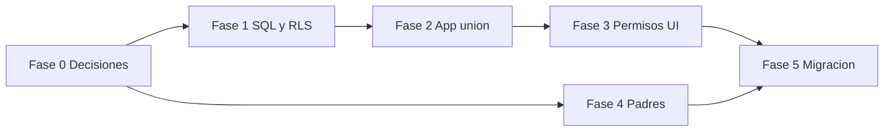

# Plan: membresías, unión a una academia y permisos por rol/categoría

**Objetivo de producto:** una sola app en la tienda; cada club (tenant) tiene su espacio aislado; el dueño/admin invita o da de alta a entrenadores y (opcional) padres; los entrenadores solo ven lo que corresponde a sus categorías asignadas.

**Evidencia del estado actual (abril 2026):** tras Fases 1–3 MVP, la tabla siguiente es histórica-resumen; el detalle vivo está en §Fase 1–3 y `EVIDENCIA_Y_SEGUIMIENTO.md` §4.

| Qué existe hoy | Dónde comprobarlo |
|----------------|------------------|
| Tenant `academias` + miembros `academia_miembros`, coach↔categoría, padres↔jugador | `supabase/migrations/20260402140000_academia_miembros_rls.sql` (+ migraciones coordinator / `academias` update) |
| Sync, binding, código club, gestión miembros, permisos por rol | `AcademiaCloudSync.kt`, `AcademiaBindingViewModel`, `AcademiaMiembros*`, `rutaPrincipalVisible` |
| Roles en dispositivo + membresía en nube | `RolDispositivo.kt`, Room `cloudMembresiaRol`, `AcademiaRoot` |

**Principio rector:** el “dueño” de la academia en negocio puede seguir siendo quien paga, pero en **datos** la academia debe identificarse por `academia_id` estable; **otros usuarios** deben enlazarse vía **membresía** (y RLS debe permitir lectura/escritura según rol), no creando otra fila `academias` al registrarse.

---

## Fase 0 — Decisiones de producto (antes de codificar)

**Estado: CERRADA** (2026-04-02). Todas las respuestas firmes, roles, punto 6 (híbrido) y punto 7 (límites por plan) están en:

→ **`docs/FASE_0_DECISIONES_CERRADAS.md`**

Las preguntas originales de la fase (referencia histórica):

1. **¿Quién puede crear una academia nueva?** (solo self-serve, solo backoffice, etc.)
2. **¿Cómo entra un entrenador?** Opciones típicas: código corto de club + email; enlace con token; invitación enviada por el dueño desde la app.
3. **¿Los padres tienen cuenta Supabase o solo “vista” con token/enlace?** (afecta coste, soporte y RLS).
4. **¿Un usuario puede pertenecer a más de una academia?** (multi-club en una cuenta).
5. **Definición de roles de negocio:** `owner`, `admin`, `coach`, `parent` (nombres finales y qué puede hacer cada uno).

**Criterio de cierre:** cumplido por `FASE_0_DECISIONES_CERRADAS.md` + fila en `EVIDENCIA_Y_SEGUIMIENTO.md` §7.

---

## Anexo A — Recomendaciones Fase 0 (producto genérico, vendible a cualquier club)

Objetivo: **un solo APK en la tienda**, marca **tuya**; cada cliente es un **tenant** (su nombre, colores, datos). No atarte a un equipo concreto en copy ni en flujos.

### A.1 Marca y tenant

- La app publicada es **tu producto**; los clubes **compran acceso** a un espacio (academia), no son dueños del software.
- Cada club = un **espacio aislado** (`academia_id` + configuración). Lenguaje de UI y ayuda: *“tu academia / tu club”*, evitar referencias a un solo caso.
- **No** prometer flujos que dependan de procesos manuales de un club famoso (Excel, etc.): el flujo debe ser **el mismo** para cualquier academia.

### A.2 Quién crea una academia nueva

- **Self-serve** para quien **activa o compra** la licencia: esa persona queda como **dueño/admin del tenant** (o recibe invitación `owner` si tú provisionas desde backoffice).
- Permite escalar ventas sin operación manual en cada alta; el **opcional** “yo te doy de alta” queda para planes enterprise o pilotos.

### A.3 Cómo entra el staff (entrenadores, coordinación)

- **Código de club corto** (p. ej. 6–8 caracteres) + registro/login con email: fácil de explicar en cualquier club.
- **Complemento opcional:** invitación por email desde la app del administrador (misma idea: atar al `academia_id` correcto).

**Roles mínimos a nombrar en Fase 0** (los nombres pueden ser internos):

| Rol conceptual | Idea |
|----------------|------|
| Owner / admin del tenant | Invita, configura club, permisos fuertes; encaja con quien paga. |
| Staff operativo | Entrenador/coordinador; después se restringe por categoría (Fase 3). |
| (Opcional) Coordinador vs entrenador | Si más adelante quieres planes o permisos distintos. |

### A.4 Padres (elegir una línea principal para el MVP)

- **Opción recomendada a largo plazo — padres con cuenta:** mismo APK; unión con código de club + vínculo al hijo (o invitación). Más trabajo en datos y RLS, pero **un solo producto** para todos los clubes.
- **Alternativa — sin cuenta:** enlaces/tokens de solo lectura; menos usuarios en Auth, otro diseño de seguridad y soporte.

**Recomendación:** decidir **una** vía para la **primera** versión de padres y dejar la otra como fase 2, en lugar de mezclar dos modelos el día uno.

### A.5 Un usuario en varias academias

- **Recomendación: sí permitirlo** (entrenador en dos escuelas, padre con hijos en distintos clubes). Evita quejas y mantiene el producto **genérico**.
- Implica en producto: tras el login, **selector de academia** (o recordar la última). Registrar esto como requisito en Fase 0.

### A.6 Monetización a nivel concepto (sin atarte a un club)

- Los ingresos se asocian al **tenant** (licencia / suscripción / cupos), no al binario de la app.
- El club es **cliente** de tu servicio; tus Términos / marca claros; ellos no copropietarios del código.

---

## Anexo B — Modelo de negocio: qué puedes cobrar y cómo estructurarlo

Esto orienta **precio y packaging**; la facturación real (Stripe, transferencia, código de activación, App Store, etc.) es decisión tuya y legal/tributaria local.

### B.1 Unidad de cobro (recomendado)

- Cobrar por **academia / club (tenant)** y no por “descarga de la app”. La app puede ser **gratis en la tienda** y el negocio ser **suscripción o licencia del espacio en la nube**.
- Ventaja: alineas ingreso con **coste variable** (Supabase: usuarios, almacenamiento, ancho de banda) y con el **valor** (todo el club usa el sistema).

### B.2 Palancas de precio (métricas que entienden los clubes)

Combina 1–2 para no complicar demasiado al inicio:

| Palanca | Ejemplo | Notas |
|---------|---------|--------|
| **Rango de jugadores activos** | Hasta 50 / 150 / ilimitado | Escala con el tamaño del club; fácil de entender. |
| **Usuarios staff** | Hasta 3 / 10 entrenadores | Limita cuentas con permisos de gestión. |
| **Cuentas padre** | Incluidas X o “ilimitado en plan alto” | Si Auth explota, aquí controlas coste. |
| **Sincronización / nube** | Plan local vs nube | Plan “solo dispositivo” barato; “equipo + respaldo” caro (cuando exista bien la nube multi-usuario). |
| **Soporte prioritario** | Email vs WhatsApp / implementación | Margen en B2B sin tocar el código. |

### B.3 Esquemas de precio típicos

1. **Suscripción mensual/anual por club** (lo más habitual en SaaS deportivo/educativo): predecible para ti y para el cliente.
2. **Setup inicial + mensualidad baja** (onboarding, migración de datos, capacitación): mejora cash flow al arrancar.
3. **Anual con descuento** frente a mensual: reduce churn y tickets de “no pagué este mes”.
4. **Plan gratuito o trial limitado** (p. ej. 14 días, o 1 categoría / N jugadores): solo si puedes soportar soporte y abuso; si no, **demo con vídeo + venta directa**.

### B.4 Qué NO recomendar al principio (salvo nicho claro)

- Cobrar solo **por descarga** en Play Store: Apple/Google se quedan comisión; no refleja uso ni nube.
- **Precio único ilimitado** sin techo: un club enorme te puede fundir en costes de Auth/Storage si no hay límites técnicos acordes.
- Demasiados planes (5+): confunden al comprador y a tu soporte.

### B.5 Alineación técnica (para cuando implementes cobro)

- Guardar en tu sistema (aunque sea una tabla `suscripciones` o integración Stripe) el **plan activo del tenant** y los **límites** (jugadores, staff, padres).
- La app o el backend pueden **bloquear** invitaciones o altas cuando se supere el límite (mensaje claro: “sube de plan”).
- Así el modelo de negocio y el producto **no se contradicen**.

### B.6 Resumen ejecutivo

- **Cobro por club** + **límites por plan** (jugadores y/o staff; padres si aplica).
- App en tienda como **canal de distribución**; ingreso principal **fuera o junto** a la suscripción del tenant.
- Empieza con **2–3 planes** máximo; sube complejidad cuando tengas datos de uso y costes reales de Supabase.

---

## Fase 1 — Modelo de datos y RLS (Supabase)

**Estado (repo):** script `supabase/migrations/20260402140000_academia_miembros_rls.sql` — tablas `academia_miembros`, `academia_miembro_categorias`, `academia_padres_alumnos`; `academias.codigo_club`; funciones `academia_is_owner`, `academia_staff_data_access`, `academia_any_access`, `academia_can_manage_members`; RLS en `academias`, `categorias`, `jugadores`, `jugador_historial`, `asistencias`, `equipo_staff`; lectura de `jugadores` para padres solo con fila en `academia_padres_alumnos`. **En Supabase:** ejecutar ese archivo en SQL Editor tras las migraciones previas. Invitaciones por token: Fase 2. Storage: sin cambio (sigue `{auth.uid()}/{academiaId}/...`).

**Entregables originales (cubiertos):** miembros con `rol` ∈ owner, admin, coordinator, coach, parent; asignación coach↔categoría; vínculo padre↔jugador para RLS.

**Criterio de cierre:** migración aplicada en proyecto de prueba; dueño histórico conserva acceso; segundo usuario con miembro `coach` valida sync; rol `parent` sin vínculo no lee `jugadores`.

**Evidencia:** `supabase/migrations/20260402140000_academia_miembros_rls.sql` + `EVIDENCIA_Y_SEGUIMIENTO.md` §4 y §7.

---

## Fase 2 — App: flujo “unirse a una academia”

**Estado (repo):** **CERRADA (MVP).** Implementado: `AcademiaBindingViewModel` + `AcademiaOnboardingScreens.kt` (pasos «¿Cómo me uno?», divisor localizado, código normalizado al unir); `AcademiaRoot` onboarding / selector / app; `joinAcademiaByCode` (RPC `join_academia_by_code`), `createOwnedAcademia`, `bindAcademiaIdAndPullConfig`; `regenerarCodigoClub`; pantalla elegir academia con subtítulo. **Invitación:** MVP sin servidor — `InviteClubIntentHelper` (compartir texto, copiar código, `mailto` con cuerpo) en Academia y en gestión de miembros. **No incluido:** invitación automática con API Admin de Supabase (requiere backend/Edge). **SQL:** `20260403150000_join_academia_rpc.sql`.

**Entregables originales:** cubiertos en MVP; invitación «desde servidor» queda fuera hasta Fase 5 / producto enterprise si aplica.

**Criterio de cierre:** probar en dispositivo con Supabase actualizado (Fase 1 + RPC): staff nuevo con código; dueño crea academia; usuario con varias membresías elige una.

**Evidencia:** `EVIDENCIA_Y_SEGUIMIENTO.md` §7; archivos citados arriba.

---

## Fase 3 — Permisos en app (coordinar con servidor)

**Estado (repo):** **CERRADA (MVP).** Incluye: `academiaGestionNubePermitida` con **coordinator**; Room v21 membresía + categorías coach; filtrado coach; padre con `rutaPrincipalVisible` en pestañas e Inicio; selector de categoría; gestión miembros (activo, rol, categorías); **revocar** = `DELETE` en `academia_miembros` (RLS `academia_can_manage_members`); **invitar** = compartir/copiar/correo (misma línea que Fase 2 MVP). SQL: `20260416130000_coordinator_manage_members.sql`, `20260417100000_academias_update_coordinator.sql`. Checklist: `docs/CHECKLIST_CIERRE_FASE_2_3.md`.

**Entregables:**

- Mapear rol de membresía → pestañas y atajos. *(Hecho MVP: `rutaPrincipalVisible` + Inicio alineado.)*
- Filtrar listas por categorías para `coach`. *(Hecho.)*
- Dueño/admin/coordinator: miembros + invitación asistida + revocar. *(Hecho MVP.)*

**Criterio de cierre:** entrenador con 2 categorías asignadas no ve jugadores de otras; dueño ve todo.

**Evidencia:** `EVIDENCIA_Y_SEGUIMIENTO.md` §7; `CHANGELOG.md`; migración coordinador en §4 evidencia.

---

## Fase 4 — Padres (según Fase 0)

**Estado (repo):** **MVP implementado (con cuenta).** Tabla existente `academia_padres_alumnos` (`academia_id`, `parent_user_id`, `jugador_id`). **Staff** (RLS `academia_staff_data_access`) inserta/elimina vínculos desde **Gestionar miembros** → «Hijos vinculados» en cuentas con rol `parent`. **Padre** lee solo jugadores vinculados (`jugadores_parent_select`) y, tras migración `20260418120000_parent_read_asistencias_historial.sql`, **asistencias** e **historial** de esos alumnos en solo lectura. **Sync:** si `cloudMembresiaRol == parent`, la app **no hace push** de datos operativos; hace pull y **poda** jugadores locales que RLS ya no devuelve (evita datos viejos si el dispositivo fue staff antes). **UI Padres:** familias ven «Mis hijos» + asistencia reciente; el staff sigue viendo el borrador para comunicados (copy/paste).

- **Sin cuenta** (tokens / enlaces firmados): fuera de este MVP (Fase 0 lo dejó para fase posterior).

**Criterio de cierre (MVP):** padre con cuenta + vínculo ve solo a sus hijos tras sync; staff puede crear/quitar vínculos; SQL de lectura padre en asistencias/historial aplicado en Supabase.

---

## Fase 5 — Operación y migración

- Script o proceso para academias ya existentes: el `user_id` actual sigue siendo dueño; opcional insertar fila en `academia_miembros` con rol `owner` para unificar comprobaciones.
- Documentar en panel Supabase: plantillas de email si usáis invitaciones.
- Considerar límites de Auth (usuarios/mes) y soporte (recuperación de contraseña).

---

## Orden recomendado y dependencias

**Riesgos:** cambiar RLS sin migrar datos puede dejar usuarios sin acceso; conviene proyecto Supabase de staging. **Duplicar lógica** dueño vs miembro genera bugs: mejor unificar en “usuario tiene membresías” incluso para el dueño.

---

## Cómo usar este plan como evidencia

1. Al cerrar cada fase: actualizar `docs/EVIDENCIA_Y_SEGUIMIENTO.md` sección **7** (tabla changelog); para Fase 2/3 MVP ver `docs/CHECKLIST_CIERRE_FASE_2_3.md`.
2. Actualizar **`CHANGELOG.md`** en la misma entrega si hay cambio visible, SQL, sync o permisos.
3. Adjuntar en §4 de evidencia las nuevas tablas y políticas cuando existan migraciones.
4. Mantener este archivo como **índice del plan**; los detalles de API pueden vivir en comentarios de migración o en un anexo `docs/ANEXO_ROLES.md` si crece mucho.

**Creado / alineado con conversación multi-tenant:** 2026-04-02.  
**Actualizado:** 2026-04-02 — Anexos A y B; **Fase 0 cerrada** documentada en `docs/FASE_0_DECISIONES_CERRADAS.md`. **2026-03-31** — **Fase 4 (MVP padres con cuenta):** `PadresAlumnosRepository`, vínculos en `AcademiaMiembrosAdminScreen`, `ParentsScreen`/`ParentsViewModel` por rol, sync solo pull para padre + poda jugadores, SQL `20260418120000_parent_read_asistencias_historial.sql`. **Fases 2 y 3 cerradas (MVP):** invitación asistida (`InviteClubIntentHelper`), revocar miembro, onboarding/pick academy UX, `CHECKLIST_CIERRE_FASE_2_3.md`. SQL coordinator en miembros y `academias` UPDATE. Siguiente foco plan: Fase 4 padres, Fase 5 operación/límites.
